# 第一章：Linux基础（实验）

---

# 软件环境

* Virtualbox
* Ubuntu 18.04 Server 64bit

---


# 步骤一：无人值守Linux安装镜像制作


1.查看网络,获取IP
```bash
#ifconfig -a
```
若网卡未开启则执行
```bash
#sudo ifconfig enp0s8 up

#sudo dhclient enp0s8
```

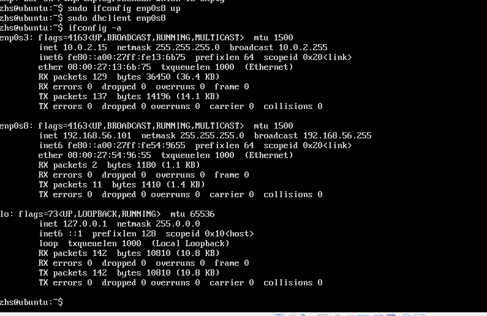

2.安装putty，打开psftp，连接Linux虚拟机(安装ssh)

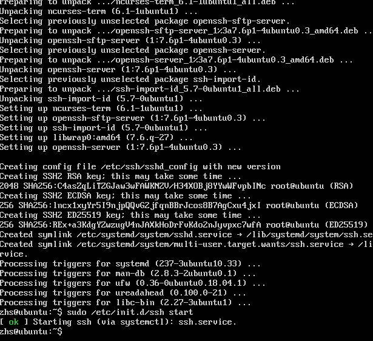

3.挂载光盘

```bash
# 根据实际情况，自行替换其中的参数
# 在当前用户目录下创建一个用于挂载iso镜像文件的目录
mkdir loopdir

# 挂载iso镜像文件到该目录
mount -o loop ubuntu-16.04.1-server-amd64.iso loopdir
```
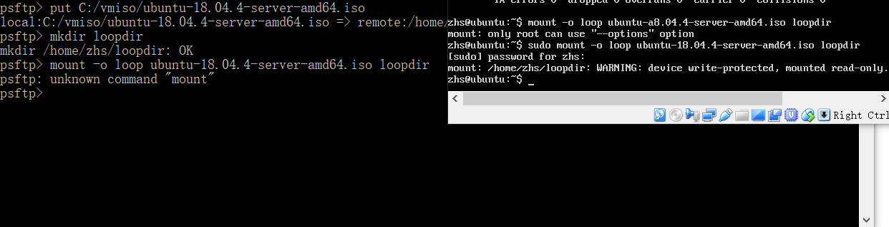

4.同步光盘内容

```bash
# 创建一个工作目录用于克隆光盘内容
mkdir cd
 
# 同步光盘内容到目标工作目录
# 一定要注意loopdir后的这个/，cd后面不能有/
rsync -av loopdir/ cd

# 卸载iso镜像
umount loopdir

```

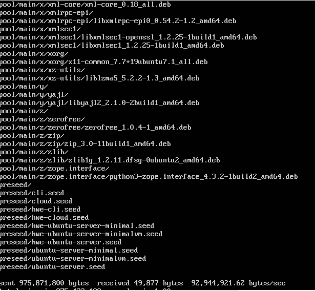

5.添加如下内容到isolinux/txt.cfg。 ( !wq 强制保存并退出 )

```bash

# 进入目标工作目录
cd cd/

# 编辑Ubuntu安装引导界面增加一个新菜单项入口
vim isolinux/txt.cfg
```
---


```bash
label autoinstall
  menu label ^Auto Install Ubuntu Server
  kernel /install/vmlinuz
  append  file=/cdrom/preseed/ubuntu-server-autoinstall.seed debian-installer/locale=en_US console-setup/layoutcode=us keyboard-configuration/layoutcode=us console-setup/ask_detect=false localechooser/translation/warn-light=true localechooser/translation/warn-severe=true initrd=/install/initrd.gz root=/dev/ram rw quiet
```

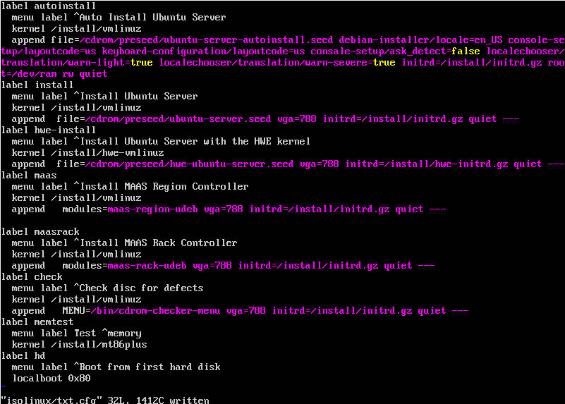

---

6.下载preseed文件并保存到指定目录

* 使用psftp上传
* 命名为ubuntu-server-autointall.seed


---

7.更改镜像文件中的md5sum.txt
```bash
# 重新生成md5sum.txt
cd ~/cd && find . -type f -print0 | xargs -0 md5sum > md5sum.txt

```

8.重新生成iso文件(安装mkisofs)


```bash
# 封闭改动后的目录到.iso
IMAGE=custom.iso
BUILD=~/cd/

mkisofs -r -V "Custom Ubuntu Install CD" \
            -cache-inodes \
            -J -l -b isolinux/isolinux.bin \
            -c isolinux/boot.cat -no-emul-boot \
            -boot-load-size 4 -boot-info-table \
            -o $IMAGE $BUILD

# 如果目标磁盘之前有数据，则在安装过程中会在分区检测环节出现人机交互对话框需要人工选择
```
9.生成custom.iso文件,并利用psftp导出到指定目录

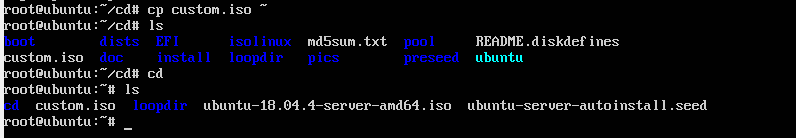


# 步骤二：Virtualbox安装完Ubuntu之后新添加的网卡如何实现系统引导自动启用和自动获取IP？

*添加双网卡

*设置putty免密登录

*若显示network error :connection refused，安装并打开ssh

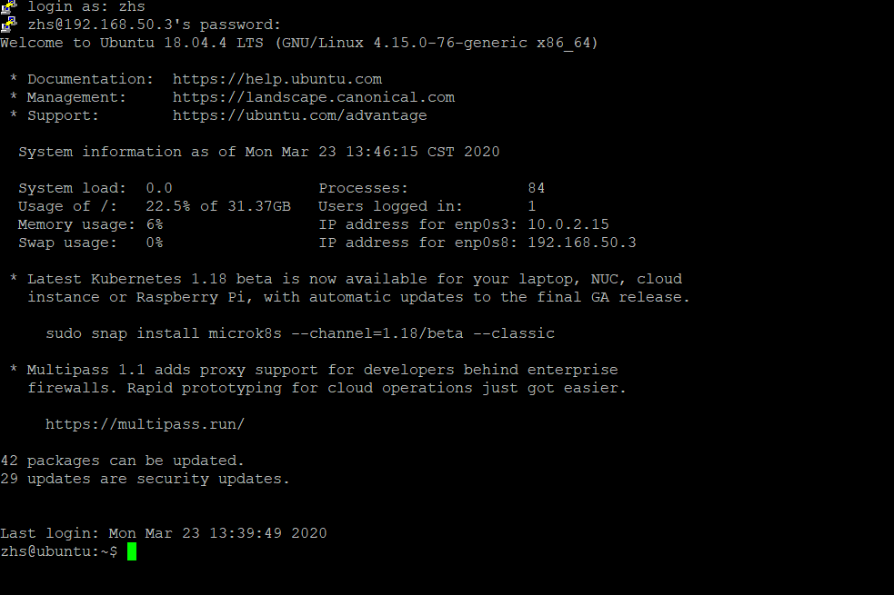

# 步骤三：使用sftp在虚拟机和宿主机之间的传输文件

*open <ipaddress>     #连接到虚拟机

*get <filename>       #从虚拟机下载文件到宿主机

*put <filename>       #从宿主机上传文件到虚拟机

---
# 差异对比：Diffuse

*指定支持的原始中文英文,设置字符集，防止中文乱码，跳过安装语言的询问
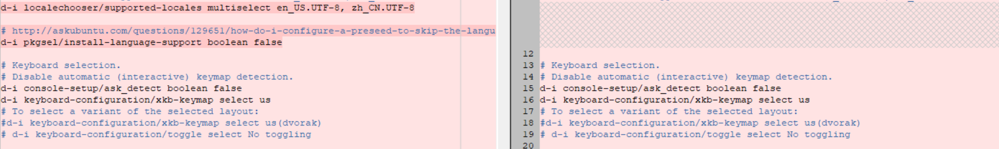

*设置网络的等待时间，开启手动配置
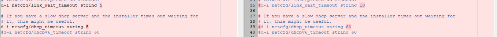

*实现了静态IP，安装过程禁止自动联网更新软件包
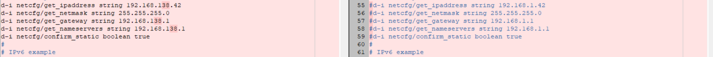

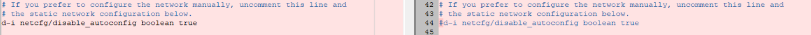

*强制设置主机名
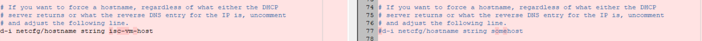

*创建一个普通用户


*设置时区，时钟
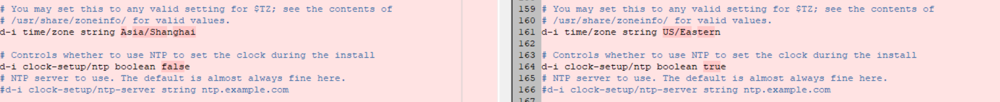

*自动分配最大可用分区


*设置多样分区策略


*安装server版,安装openssh—server，不启动更新
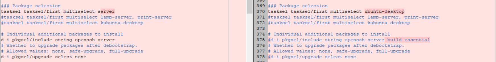

*启动自动更新策略


---

# 参考文献


* [2015-linux-public-kjAnny](https://github.com/CUCCS/2015-linux-public-kjAnny/tree/master/%E5%AE%9E%E9%AA%8C1%EF%BC%9A%E6%97%A0%E4%BA%BA%E5%80%BC%E5%AE%88%E5%AE%89%E8%A3%85iso%E5%B9%B6%E5%9C%A8Virtualbox%E4%B8%AD%E5%AE%8C%E6%88%90%E8%87%AA%E5%8A%A8%E5%8C%96%E5%AE%89%E8%A3%85)
  
* [2015-linux-public-songyawen](https://github.com/CUCCS/2015-linux-public-songyawen/tree/master/exp1)
