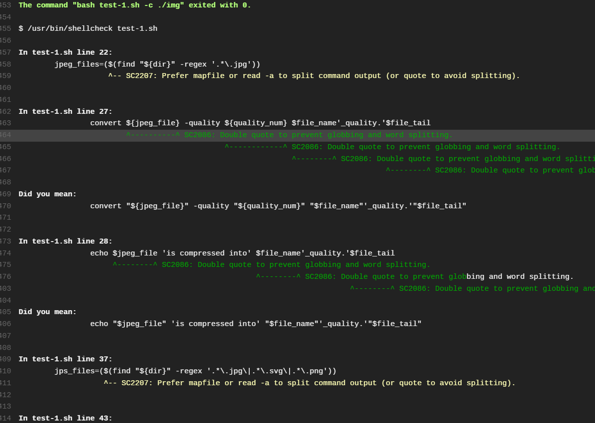
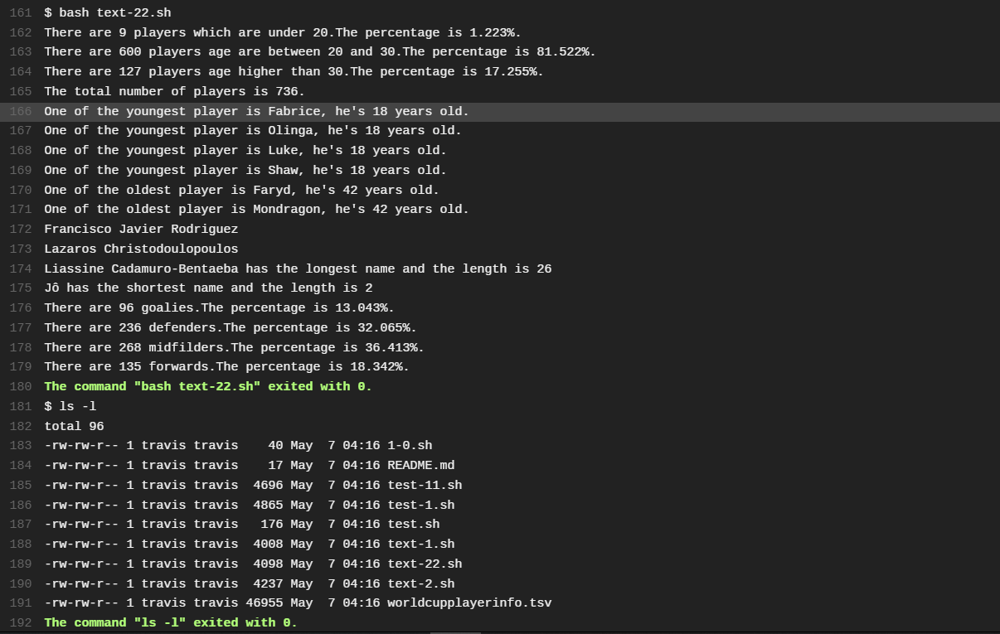
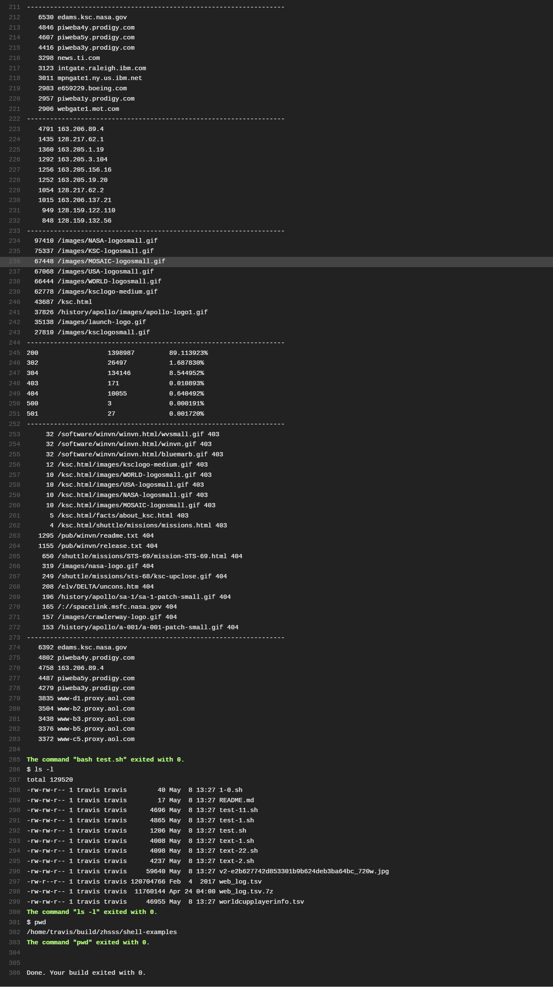

## shell编程

### 任务一：用bash编写一个图片批处理脚本，实现以下功能：

- 支持命令行参数方式使用不同功能

  - 帮助

     

- 支持对指定目录下所有支持格式的图片文件进行批处理

- 支持以下常见图片批处理功能的单独使用或组合使用

  - 支持对jpeg格式图片进行图片质量压缩

     

  - 支持对jpeg/png/svg格式图片在保持原始宽高比的前提下压缩分辨率

     

  - 支持对图片批量添加自定义文本水印
     

  - 支持批量重命名（统一添加文件名前缀或后缀，不影响原始文件扩展名）

     
     

  - 支持将png/svg图片统一转换为jpg格式图片

     

### 任务二：用bash编写一个文本批处理脚本，对附件分别进行批量处理完成相应的数据统计任务

### 任务二：用bash编写一个文本批处理脚本，对附件分别进行批量处理完成相应的数据统计任务

- Web服务器访问日志

- 统计访问来源主机TOP 100和分别对应出现的总次数

- 统计访问来源主机TOP 100 IP和分别对应出现的总次数

  
- 统计最频繁被访问的URL TOP 100

- 统计不同响应状态码的出现次数和对应百分比

- 分别统计不同4XX状态码对应的TOP 10 URL和对应出现的总次数

- 给定URL输出TOP 100访问来源主机

## 参考
    
  * [2015-linux-public-songyawen](https://github.com/CUCCS/2015-linux-public-songyawen/tree/master/exp4)
  * [图片压缩](https://www.iteye.com/blog/justcoding-2022467)

