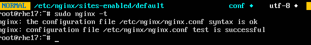
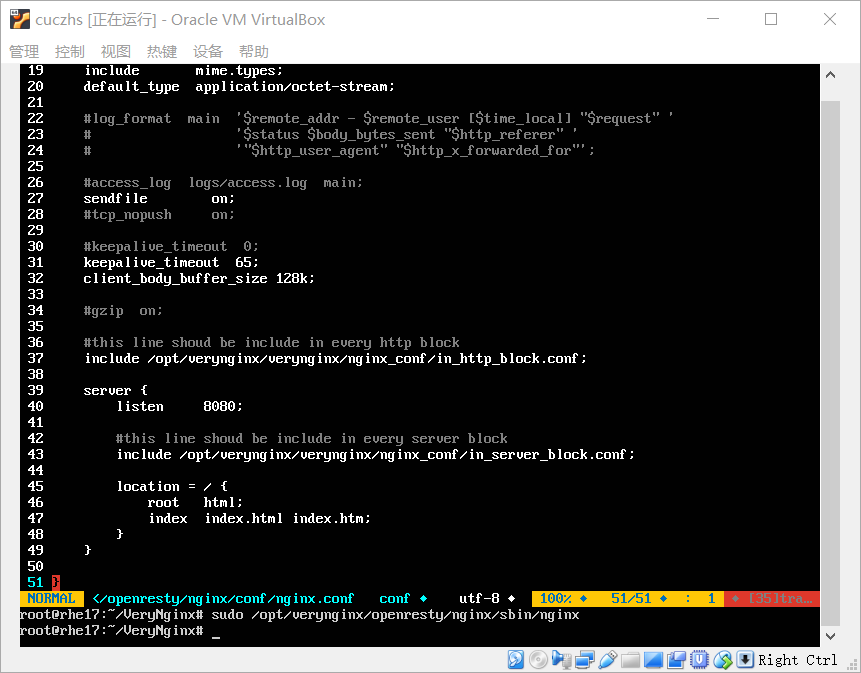
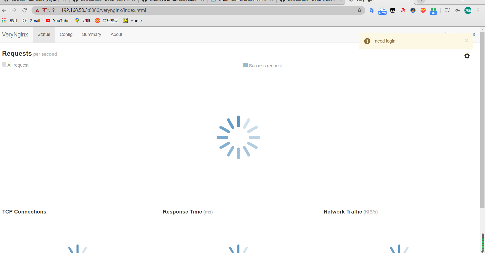
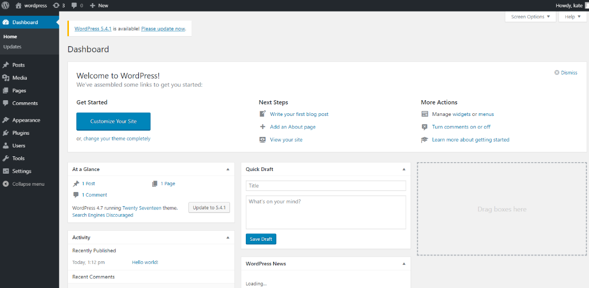
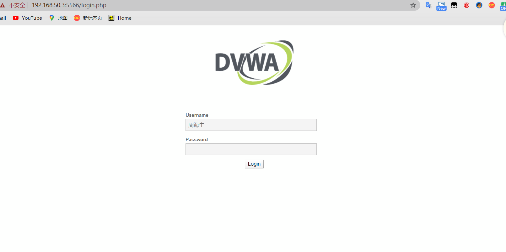
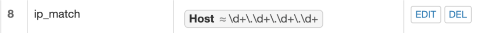
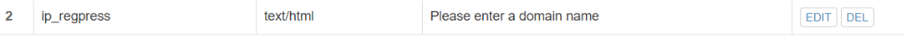
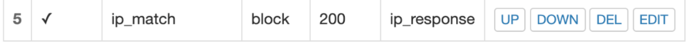
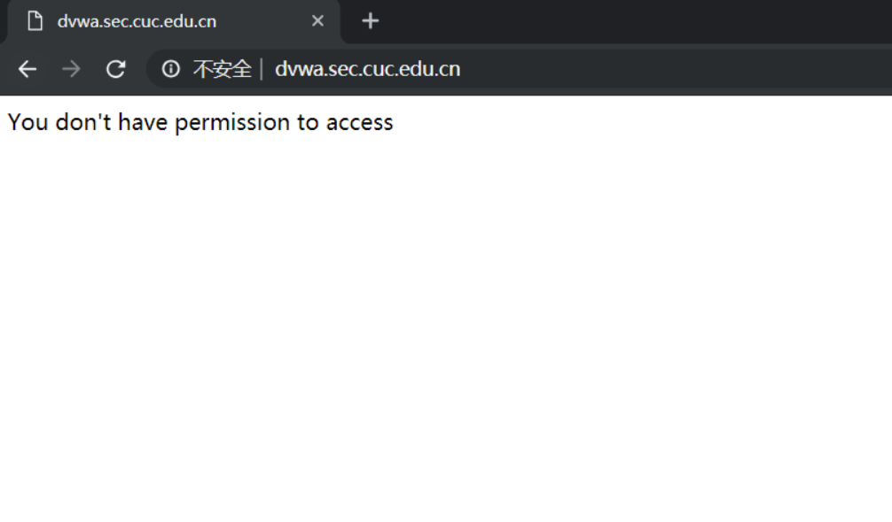

## WEB服务器


### 实验环境搭建

#### Nginx
 
    
    sudo apt-get update
    sudo apt-get install nginx -y


#### VeryNginx


    
    git clone https://github.com/alexazhou/VeryNginx.git
    sudo python install.py install
    sudo apt-get update
    sudo apt install libssl libssl1.0-dev
    apt install libpcre3 libpcre3-dev
    sudo apt install zlib1g-dev
  
- 修改/opt/verynginx/openresty/nginx/conf/nginx.conf文件配置,将server模块监听端口改为8080

- 修改主机hosts文件,添加  192.168.50.3 vn.sec.cuc.edu.cn
- 相关命令
    ```bash
    #启动服务
    /opt/verynginx/openresty/nginx/sbin/nginx

    #停止服务
    /opt/verynginx/openresty/nginx/sbin/nginx -s stop

    #重启服务
    /opt/verynginx/openresty/nginx/sbin/nginx -s reload
    ```
- 运行结果
    
   
#### 安装WordPress

##### Mysql
- 安装mysql
    ```
    sudo apt install -y mysql-server
    ```
- 创建数据库
    ```sql
    CREATE DATABASE wordpress DEFAULT CHARACTER SET utf8 COLLATE utf8_unicode_ci;   
    GRANT ALL ON wordpress.* TO  'wordpressuser'@'localhost' IDENTIFIED BY 'password';    
    FLUSH PRIVILEGES;
    ```
##### PHP
- 安装相关拓展
    ```bash
    sudo apt update
    sudo apt install php-curl php-gd php-intl php-mbstring php-soap php-xml php-xmlrpc php-zip
    ```
- 重启
    ```bash
    sudo systemctl restart php7.2-fpm
    ```

##### WordPress下载
```bash
cd /tmp
# 将安装包下载至临时目录
下载太慢，使用pstfp上传
# 解压
tar xzvf wordpress-4.7.tar.gz

# 复制配置文件到wordpress实际读取的文件中
 cp /tmp/wordpress/wp-config-sample.php /tmp/wordpress/wp-config.php

 # 创建wordpress根目录
 mkdir /var/www/html/wq.sec.cuc.edu.cn

 # 将tmp目录下文件复制到根目录
 sudo cp -a /tmp/wordpress/. /var/www/html/wq.sec.cuc.edu.cn

 # 分配文件所有权
 sudo chown -R www-data:www-data /var/www/wordpress
 ```
##### Nginx配置
- 实现使用Ip地址访问wordpress
    - 修改wp-config.php,更新数据库相关信息
    - 为wordpress创建配置/etc/nginx/sites-available/wp.sec.cuc.edu.cn,保留default文件
        ```bash
        server {
            listen 8080;
            
            root /var/www/html/wp.sec.cuc.edu.cn;

            index index.php index.html index.htm index.nginx-debian.html;

            server_name 192.168.50.3;

            location / {

                    try_files $url/=404;
            }

            location ~ \.php$ {
                    include snippets/fastcgi-php.conf;
                    fastcgi_pass unix:/var/run/php/php7.2-fpm.sock;
            }

            location ~ /\.ht{
                    deny all;
            }
        }
        ```
    - 创建软链接
        ```bash
        sudo ln -s /etc/nginx/sites-available/wp.sec.cuc.edu.cn /etc/nginx/sites-enabled/
        ```
    - 重启nginx
        ```bash
        sudo nginx -t
        sudo systemctl restart nginx
        sudo systemctl reload nginx
        ```
    


    - http://192.168.50.3:8080访问

       
    


#### 安装DVWA

- DVWA
   ```bash

    # 在/var/www/html下为DVWA创建目录
    sudo mkdir /var/www/html/DVWA
    # 将安装仓库克隆到临时目录下
    git clone https://github.com/ethicalhack3r/DVWA /tmp/DVWA

    # 将安装文件拷贝到/var/www/html/DVWA网站根目录下
    sudo rsync -avP /tmp/DVWA/ /var/www/html/DVWA
    ```

- 数据库配置
    
    ```bash
    cp /var/www/html/DVWA/config/config.inc.php.dist /var/www/html/DVWA/config/config.inc.php
    CREATE DATABASE dvwa DEFAULT CHARACTER SET utf8 COLLATE utf8_unicode_ci;   
    GRANT ALL ON dvwa.* TO 'dvwauser'@'localhost' IDENTIFIED BY 'password';
    FLUSH PRIVILEGES;
    exit；
    sudo systemctl restart mysql
    ```

- DVWA文件配置
     ```bash
    sudo sudo vim /var/www/html/DVWA/config/config.inc.php

    $_DVWA[ 'db_server' ]   = '127.0.0.1';
    $_DVWA[ 'db_database' ] = 'dvwa';
    $_DVWA[ 'db_user' ]     = 'dvwauser';
    $_DVWA[ 'db_password' ] = 'password';
    ```
- PHP配置
    - 修改/etc/php/7.2/fpm/php.ini
        ```bash
        vim /etc/php/7.2/fpm/php.ini
        allow_url_include = On
        allow_url_fopen = On
        display_errors = Off
        ```
    - DVWA文件访问权限
        ```bash
        chown -R www-data.www-data /var/www/html/
        ```

- Nginx配置

    - 为DVWA创建Nginx配置文件
        ```bash
        sudo vim /etc/nginx/sites-avaliable/dvwa
        ```
    - /etc/nginx/sites-avaliable/default

        ```bash
        server {
            listen 5566;
            root /var/www/html/DVWA;
            index index.php index.html index.htm index.nginx-debian.html;

            server_name 192.168.50.3;

            location / {

                    try_files $url/=404;
            }

            location ~ \.php$ {
                    include snippets/fastcgi-php.conf;
                    fastcgi_pass unix:/var/run/php/php7.2-fpm.sock;
            }

            location ~ /\.ht{
                    deny all;
            }
        }

        ```
    - 创建软链接
        ```bash
        sudo ln -s /etc/nginx/sites-available/dvwa /etc/nginx/sites-enabled/
        ```
    - 重启nginx
        ```bash
        sudo nginx -t
        sudo systemctl restart nginx
        sudo systemctl reload nginx
        unlink -s /etc/nginx/sites-available/wp.sec.cuc.edu.cn

        ```



### 安全加固要求
- 使用IP地址方式均无法访问上述任意站点，并向访客展示自定义的友好错误提示信息页面-1
  - 添加Matcher

  - 添加response

  - 添加filter



    
- Damn Vulnerable Web Application (DVWA)只允许白名单上的访客来源IP，其他来源的IP访问均向访客展示自定义的友好错误提示信息页面-2
   - 同上添加match 添加response 添加filter

 
- 在不升级Wordpress版本的情况下，通过定制[VeryNginx](https://github.com/alexazhou/VeryNginx)的访问控制策略规则，热修复[WordPress < 4.7.1 - Username Enumeration](https://www.exploit-db.com/exploits/41497/)
    - 只需添加添加Matcher和filter

- 通过配置[VeryNginx](https://github.com/alexazhou/VeryNginx)的Filter规则实现对[Damn Vulnerable Web Application (DVWA)](http://www.dvwa.co.uk/)的SQL注入实验在低安全等级条件下进行防护
    - 同时添加Matcher、response与filter
### VeryNginx配置要求
- [VeryNginx](https://github.com/alexazhou/VeryNginx)的Web管理页面仅允许白名单上的访客来源IP，其他来源的IP访问均向访客展示自定义的友好错误提示信息页面-3
    - 添加Matcher、response、filter
    - 在ubuntu18.04的/etc/hosts文件下添加192.168.50.3 vn.sec.cuc.edu.cn
    

- 通过定制[VeryNginx](https://github.com/alexazhou/VeryNginx)的访问控制策略规则实现：
    **限制站点单IP访问速率**
    - 限制DVWA站点的单IP访问速率为每秒请求数 < 50
    - 限制Wordpress站点的单IP访问速率为每秒请求数 < 20
    - 超过访问频率限制的请求直接返回自定义错误提示信息页面-4
    
    - frequency limit

    - response

            

### 参考资料

- [VeryNginx](https://github.com/alexazhou/VeryNginx/blob/master/readme_zh.md)
- [VeryNginx故障排查](https://github.com/alexazhou/VeryNginx/wiki/Trouble-Shooting)
- [2015-linux-public-songyawen/tree/master/exp5](https://github.com/CUCCS/2015-linux-public-songyawen/tree/master/exp5)


