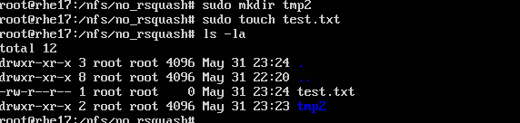

# SHELL 脚本编程练习进阶
## 实验环境
- 工作主机(ubuntu-server-18.04)
    - hostonly:```192.168.50.3```
- 目标主机(ubuntu-server-18.04)
    - hostonly:```192.168.50.4```
## 实验步骤


## 实验步骤
### 工作主机免密SSH登录目标主机
- #### 生成并导入SSH-KEY至目标主机
    - 在工作主机生成ssh-key
        ```bash
        # foo为Key的名称
        ssh-keygen -f foo
        ```
    - 修改目标主机```/etc/ssh/sshd_config```配置
        ```bash
        # 设置可通过口令认证SSH
        PasswordAuthentication yes
        # 可以root用户登录
        PermitRootLogin yes
        ```
    - 重启目标主机的SSH服务
        ```bash
        sudo systemctl restart ssh
        ```
    - 工作主机通过```ssh-copy-id```方式导入ssh-key
        ```bash
        ssh-copy-id -i ~/foo root@192.168.56.102
        ```
- #### 设置免密登录
    - 取消root口令并禁用口令登录
        ```bash
        sudo passwd -l root
        # 修改目标主机配置文件
        vim /etc/ssh/sshd_config
        PasswordAuthentication no
        PermitRootLogin without-password

        # 重启ssh服务
        sudo systemctl restart ssh
       ```


### FTP
#### 实验工具
- vsftpd
##### 选择原因:
- 轻量级ftp服务器软件，可以满足实验需求
- 有大型站点信任并使用vsftpd,侧面证明安全性
- CVE漏洞数量位于```ProFTPd```和```PureFTPd```之间
- 网上参考资料多

#### 实验过程
[vsftpd.sh](bash/vsftpd.sh)
- 通过工作主机运行脚本在目标主机安装vsftpd并完成相关配置
    - 将```vsftpd.sh```拷贝到目标主机
    - 在工作主机运行```vsftpd.sh```脚本
    
- 配置一个提供匿名访问的FTP服务器，匿名访问者可以访问1个目录且仅拥有该目录及其所有子目录的只读访问权限;
    - 匿名用户拥有且只拥有一个目录
    
    - 匿名用户对该目录只有只读权限
    
- 配置一个支持用户名和密码方式访问的账号，该账号继承匿名访问者所有权限，且拥有对另1个独立目录及其子目录完整读写（包括创建目录、修改文件、删除文件等）权限;
    - 访问,增加文件
    
    - 删除文件,创建目录
    
-  FTP用户不能越权访问指定目录之外的任意其他目录和文件;

- 匿名访问权限仅限白名单IP来源用户访问，禁止白名单IP以外的访问


### NFS
#### 实验文件
- [nfs_c.sh](bash/nfs_c.sh)
- [nfs_s.sh](bash/nfs_s.sh)

#### 实验过程
- 在通过工作主机运行脚本在目标主机安装vsftpd并完成相关配置
    - 将```nfs_s.sh```拷贝到目标主机，工作主机运行```nfs_s.sh```脚本
    - 在工作主机运行```nfs_c.sh```脚本
  
  
- 在1台Linux上配置NFS服务，另1台电脑上配置NFS客户端挂载2个权限不同的共享目录，分别对应只读访问和读写访问权限;
    - 创建的两个目录分别为:只读--```/nfs/gen_r```和读写--```/nfs/gen_rw```

    - 两个共享文件目录对应只读和读写访问权限
    
- 共享目录中文件、子目录的属主、权限信息


- 根据[资料](https://www.digitalocean.com/community/tutorials/how-to-set-up-an-nfs-mount-on-ubuntu-18-04)
    > By default, NFS translates requests from a root user remotely into a non-privileged user on the server. This was intended as security feature to prevent a root account on the client from using the file system of the host as root. no_root_squash disables this behavior for certain shares.
    - 添加两个/home下的共享目录，分别设置```no_root_squash```和不设置```no_root_squash```
        - 对于设置了```no_root_squash```的共享目录
          

        
        - 没有设置过```no_root_squash```的共享目录，无法在工作机器(client)写入文件，创建目录
        

##### 参考资料
- [how to set up an nfs mount on ubuntu 18.04](https://www.digitalocean.com/community/tutorials/how-to-set-up-an-nfs-mount-on-ubuntu-18-04)   

### DHCP
#### 实验文件
- [dhcpd.conf](conf/dhcpd.conf)
- [isc-dhcp-server](conf/isc-dhcp-server)

#### 实验过程
- client [intnet网卡]
    ```bash
    network:
    version: 2
    renderer: networkd
    ethernets:
        enp0s3:
            dhcp4: yes
        enp0s8:
            dhcp4: yes

    ```
- server [intnet网卡]
    ```bash
    network:
    version: 2
    renderer: networkd
    ethernets:
        enp0s3:
            dhcp4: yes
        enp0s8:
            dhcp4: no
            addresses: [192.168.57.1/24]
    ```
##### Server
运行脚本
##### Client
- 在```/etc/01-netcfg.yaml```文件中添加```enp0s8```,设置```dhcp4: yes```
- ```sudo netplan apply```使配置生效
##### 实验结果


### DNS[手动配置]

#### 实验过程
##### server
- 安装```Bind```
    ```bash
    sudo apt-get install bind9
    ```
- 修改配置文件```options```
    ```bash
    sudo vim /etc/bind/named.conf.options
    # 添加如下配置
    listen-on { 192.168.57.1; };
    allow-transfer { none; };
    forwarders {
        8.8.8.8;
        8.8.4.4;
    };
    ```
- 编辑配置文件```named.conf.local```
    ```bash
    sudo vim /etc/bind/named.conf.local

    # 添加如下配置
    zone "cuc.edu.cn" {
        type master;
        file "/etc/bind/db.cuc.edu.cn";
    };
    ```
- 生成配置文件```db.cuc.edu.cn```
    ```bash
    sudo cp /etc/bind/db.local /etc/bind/db.cuc.edu.cn
    ```
- 编辑配置文件```db.cuc.edu.cn```
    ```bash
    
    $TTL    604800
    

    @       IN      SOA     cuc.edu.cn. admin.cuc.edu.cn. (
                                2         ; Serial
                            604800         ; Refresh
                            86400         ; Retry
                            2419200         ; Expire
                            604800 )       ; Negative Cache TTL
    ;
    
            IN      NS      ns.cuc.edu.cn.
    ns      IN      A       192.168.57.1
    wp.sec.cuc.edu.cn.      IN      A       192.168.57.1
    dvwa.sec.cuc.edu.cn.    IN      CNAME   wp.sec.cuc.edu.cn.
    @       IN      AAAA    ::1

    ```
##### client
- 安装```resolvconf```
    ```bash
    sudo apt-get update && sudo apt-get install resolvconf
    ```
- 修改配置文件
    ```bash
    sudo vim /etc/resolvconf/resolv.conf.d/head
    # 增加配置
    search cuc.edu.cn
    nameserver 192.168.57.1

    ```

##### 实验结果


##### Samba

----

修改配置文件smb.conf,guest 设置匿名共享目录，目录demo使用用户名密码可以进行读写。

```bash
[guest]
        # This share allows anonymous (guest) access
        # without authentication!
        path = /srv/samba/guest/
        read only = yes
        guest ok = yes

[demo]
        # This share requires authentication to access
        path = /srv/samba/demo/
        read only = no
        guest ok = no
        force create mode = 0660
        force directory mode = 2770
        force user = demoUser
        force group = demoGroup
```


Server：Linux & Client：Windows

- [x] Linux设置匿名访问共享目录/Linux设置用户名密码方式的共享目录

  ```bash
  #安装
  sudo apt install samba
  #创建用户
  useradd -M -s /sbin/nologin ${SMB_USER}
  sudo passwd smbuser
  
  #在linux中添加同名用户
  smbpasswd -a smbuser
  #使设置的账户生效
  smbpasswd -e smbuser
  #创建用户组并加入
  groupadd smbgroup
  usermod -G smbgroup smbuser
  #创建用于共享的文件夹并修改用户组
  mkdir -p /home/samba/guest/
  mkdir -p /home/samba/demo/
  chgrp -R smbgroup /home/samba/guest/
  chgrp -R smbgroup /home/samba/demo/
  chmod 2775 /home/samba/guest/
  chmod 2770 /home/samba/demo/
  #启动Samba
  smbd
  
  #客户端为win10访问共享文件夹
  \\192.168.50.3\guest
  \\192.168.50.3\demo
  ```

Server：Windows & Client：Linux

- [ ] Linux访问Windows的匿名共享目录

- [] 在windows指定目录设置为共享用户名密码方式共享目录[win10局域网共享文件方法](https://blog.csdn.net/u012491783/article/details/73251515)

  ```bash
  #在linux下载安装smbclient
  sudo apt-get install smbclient
  #查看所有共享目录（需要输入windows的用户名和密码 -u指定windows的登陆用户名 然后需要输入密码）
  smbclient -L 169.254.134.111 -U Administer
  #访问共享目录
  smbclient  -U Administer //169.254.134.111/masm
  ```

  Linux访问Windows的用户名密码方式共享目录


- [下载整个目录](https://indradjy.wordpress.com/2010/04/14/getting-whole-folder-using-smbclient/)

  直接根据教程操作（**当前登陆文件夹默认为文件下载根目录**）

  ```bash
  首先从linux登陆到ubuntu的共享文件夹，需要输入密码
  命令行输入 tarmode
  命令行输入 recurse
  命令行输入 prompt
  命令行输入 mget 指定文件被下载到的目录

### 实验结果


### 工作主机免密SSH登录目标主机
- #### 生成并导入SSH-KEY至目标主机
    - 在工作主机生成ssh-key
        ```bash
        # foo为Key的名称
        ssh-keygen -f foo
        ```
    - 修改目标主机```/etc/ssh/sshd_config```配置
        ```bash
        # 设置可通过口令认证SSH
        PasswordAuthentication yes
        # 可以root用户登录
        PermitRootLogin yes
        ```
    - 重启目标主机的SSH服务
        ```bash
        sudo systemctl restart ssh
        ```
    - 工作主机通过```ssh-copy-id```方式导入ssh-key
        ```bash
        ssh-copy-id -i ~/foo root@192.168.56.102
        ```
- #### 设置免密登录
    - 取消root口令并禁用口令登录
        ```bash
        sudo passwd -l root
        # 修改目标主机配置文件
        vim /etc/ssh/sshd_config
        PasswordAuthentication no
        PermitRootLogin without-password

        # 重启ssh服务
        sudo systemctl restart ssh
        ```


##### 参考资料
- [linux-2019-luyj/blob/Linux_exp0x06](https://github.com/CUCCS/linux-2019-luyj/blob/Linux_exp0x06/Linux_exp0x06/Linux_exp0x06.md)
- [linux-2019-jackcily/blob](https://github.com/CUCCS/linux-2019-jackcily/blob/job6/job6/job6.md)

- https://github.com/CUCCS/linux/blob/master/2017-1/TJY/%E7%BD%91%E7%BB%9C%E8%B5%84%E6%BA%90%E5%85%B1%E4%BA%AB/%E7%BD%91%E7%BB%9C%E8%B5%84%E6%BA%90%E5%85%B1%E4%BA%AB.md
- https://github.com/CUCCS/linux/tree/master/2017-1/snRNA/ex6

- [Configure DHCP Client : Ubuntu](https://www.server-world.info/en/note?os=Ubuntu_18.04&p=dhcp&f=2)
- [How To Configure BIND as a Private Network DNS Server on Ubuntu 18.04](https://www.digitalocean.com/community/tutorials/how-to-configure-bind-as-a-private-network-dns-server-on-ubuntu-18-04)


